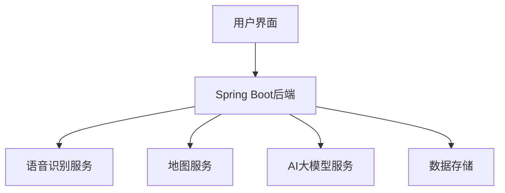

# Web版AI旅行规划师

## 项目简介

Web版AI旅行规划师是一款基于人工智能技术的旅行规划应用，旨在简化旅行规划过程。用户可以通过语音或文字输入旅行需求，AI会自动生成详细的旅行路线和建议，并提供实时旅行辅助。

## 核心功能

### 1. 智能行程规划
- 用户可以通过语音（或文字）输入旅行目的地、日期、预算、同行人数、旅行偏好
- AI自动生成个性化的旅行路线，包括交通、住宿、景点、餐厅等详细信息

### 2. 费用预算与管理
- AI进行预算分析和费用估算
- 记录旅行开销（支持语音输入）

### 3. 用户管理与数据存储
- 注册登录系统，用户可以保存和管理多份旅行计划
- 云端行程同步，方便多设备查看和修改

## 技术栈

### 后端技术
- Java 21
- Spring Boot 3.3.4
- Maven

### 前端技术
- React 18
- Vite
- HTML5/CSS3/JavaScript

### 第三方服务集成
- 语音识别：科大讯飞语音识别API
- 地图服务：高德地图API
- AI大模型：通义千问API（可替换为其他大语言模型API）

## 系统架构



## 快速开始

### 环境要求
- JDK 1.8
- Node.js 16+
- Maven 3.8+
- Docker (可选，用于容器化部署)

### 配置环境变量
在运行应用之前，需要配置以下环境变量：

```bash
# 讯飞语音识别API配置
XFYUN_APP_ID=your_xfyun_app_id
XFYUN_API_KEY=your_xfyun_api_key
XFYUN_API_SECRET=your_xfyun_api_secret

# 大模型API配置（可选，如与语音识别使用不同配置）
LLM_APP_ID=your_llm_app_id
LLM_API_KEY=your_llm_api_key
LLM_API_SECRET=your_llm_api_secret

# 高德地图API配置
AMAP_KEY=your_amap_key
```

#### 获取讯飞API密钥
1. 访问[讯飞开放平台](https://www.xfyun.cn/)
2. 注册账号并登录
3. 创建新应用，选择"语音识别"服务
4. 获取应用的APPID、API Key和API Secret

#### 获取大模型API密钥
1. 访问[讯飞开放平台](https://www.xfyun.cn/)
2. 注册账号并登录
3. 创建新应用或使用现有应用，确保已开通"星火大模型"服务
4. 获取应用的APPID、API Key和API Secret

#### 获取高德地图API密钥
1. 访问[高德开放平台](https://lbs.amap.com/)
2. 注册账号并登录
3. 创建新应用，选择"Web服务"平台
4. 获取API Key

### 本地运行

1. 克隆项目代码：
```bash
git clone <项目地址>
cd AITravelPlanner
```

2. 构建前端：
```bash
npm install
npm run build
```

3. 构建后端：
```bash
mvn clean package
```

4. 运行应用：
```bash
java -jar target/AITravelPlanner-1.0-SNAPSHOT.jar
```

或者使用Maven直接运行：
```bash
mvn spring-boot:run
```

### Docker部署

1. 构建Docker镜像：
```bash
docker build -t aitravelplanner .
```

2. 运行容器：
```bash
docker run -p 8080:8080 \
  -e XFYUN_APP_ID=your_xfyun_app_id \
  -e XFYUN_API_KEY=your_xfyun_api_key \
  -e XFYUN_API_SECRET=your_xfyun_api_secret \
  -e LLM_APP_ID=your_llm_app_id \
  -e LLM_API_KEY=your_llm_api_key \
  -e LLM_API_SECRET=your_llm_api_secret \
  -e AMAP_KEY=your_amap_key \
  aitravelplanner
```

或者使用docker-compose：
```bash
docker-compose up -d
```

### 导出和导入Docker镜像

要创建可以直接分发的Docker镜像文件：

1. 构建镜像：
```bash
docker build -t aitravelplanner .
```

2. 导出为tar文件：
```bash
docker save -o aitravelplanner.tar aitravelplanner
```

3. （可选）压缩文件：
```bash
gzip aitravelplanner.tar
```

在目标机器上导入和运行：

1. 导入镜像：
```bash
docker load -i aitravelplanner.tar
```

或者如果文件被压缩：
```bash
gunzip -c aitravelplanner.tar.gz | docker load
```

2. 运行容器：
```bash
docker run -p 8080:8080 \
  -e XFYUN_APP_ID=your_xfyun_app_id \
  -e XFYUN_API_KEY=your_xfyun_api_key \
  -e XFYUN_API_SECRET=your_xfyun_api_secret \
  -e AMAP_KEY=your_amap_key \
  -e LLM_API_KEY=your_llm_api_key \
  aitravelplanner
```

## API接口文档

### 旅行计划相关接口
- `POST /api/plans` - 创建旅行计划
- `GET /api/plans/{id}` - 获取旅行计划详情
- `PUT /api/plans/{id}` - 更新旅行计划
- `DELETE /api/plans/{id}` - 删除旅行计划

### 用户管理接口
- `POST /api/users/register` - 用户注册
- `POST /api/users/login` - 用户登录
- `GET /api/users/{id}` - 获取用户信息
- `PUT /api/users/{id}` - 更新用户信息

### 预算管理接口
- `POST /api/budgets` - 创建预算
- `GET /api/budgets/{id}` - 获取预算详情
- `PUT /api/budgets/{id}` - 更新预算
- `DELETE /api/budgets/{id}` - 删除预算

### 语音识别接口
- `POST /api/voice/recognize` - 语音识别（上传文件）
- `GET /api/voice/realtime` - 获取实时语音识别WebSocket连接信息

### 地图服务接口
- `GET /api/map/geocode` - 地理编码
- `GET /api/map/route` - 路线规划
- `GET /api/map/nearby` - 附近地点搜索

## 语音识别服务

本项目集成了科大讯飞语音识别API，支持两种使用方式：

1. **文件上传识别**：用户上传音频文件，后端调用讯飞API进行识别
2. **实时语音识别**：通过WebSocket建立实时连接，流式传输音频数据进行识别

### 支持的音频格式
- 音频编码：PCM
- 采样率：16000Hz
- 位深度：16bit
- 声道数：单声道

### 使用流程
1. 前端录制音频或选择音频文件
2. 通过WebSocket或HTTP上传音频数据
3. 后端调用讯飞语音识别API
4. 返回识别结果给前端

### 服务架构
语音识别服务主要由以下几个组件构成：
- `VoiceRecognitionService`：主服务类，提供统一的语音识别接口
- `XfyunWebSocketService`：与讯飞API通信的核心服务，处理WebSocket连接和数据传输
- `VoiceWebSocketHandler`：处理前端WebSocket连接，用于实时语音识别

### 配置说明
在使用语音识别服务之前，需要在环境变量中配置以下参数：
- `XFYUN_APP_ID`：讯飞应用ID
- `XFYUN_API_KEY`：讯飞API Key
- `XFYUN_API_SECRET`：讯飞API Secret

### 测试语音识别功能
项目提供了一个测试类用于验证语音识别服务是否正常工作：

1. 确保已配置讯飞API密钥环境变量
2. 运行测试：
   ```bash
   mvn exec:java -Dexec.mainClass="com.travelplanner.service.VoiceRecognitionServiceTest"
   ```

或者直接运行测试脚本：
```bash
test-voice-recognition.bat
```

测试将使用项目资源目录中的`iat/16k_10.pcm`音频文件进行语音识别测试。

## 开发指南

### 项目结构
```
AITravelPlanner/
├── src/
│   ├── main/
│   │   ├── java/com/travelplanner/
│   │   │   ├── controller/     # 控制器层
│   │   │   ├── model/          # 数据模型
│   │   │   ├── service/        # 业务逻辑层
│   │   │   ├── websocket/      # WebSocket处理
│   │   │   ├── config/         # 配置类
│   │   │   └── Application.java # 启动类
│   │   └── resources/
│   │       ├── static/         # 前端静态资源
│   │       ├── iat/            # 语音识别测试音频文件
│   │       └── application.yml # 配置文件
├── pom.xml                     # Maven配置文件
├── package.json                # 前端依赖配置
├── vite.config.js              # Vite配置
├── Dockerfile                  # Docker配置
├── docker-compose.yml          # Docker Compose配置
├── test-voice-recognition.bat  # 语音识别测试脚本
└── README.md                   # 项目说明文档
```

### 添加新功能
1. 在[model](file:///D:/Personal/%E7%A0%94%E4%B8%80%E4%B8%8A/%E5%A4%A7%E6%A8%A1%E5%9E%8B/Web%20%E7%89%88AI%20%E6%97%85%E8%A1%8C%E8%A7%84%E5%88%92%E5%B8%88/AITravelPlanner/src/main/java/com/travelplanner/model)包中创建数据模型类
2. 在[service](file:///D:/Personal/%E7%A0%94%E4%B8%80%E4%B8%8A/%E5%A4%A7%E6%A8%A1%E5%9E%8B/Web%20%E7%89%88AI%20%E6%97%85%E8%A1%8C%E8%A7%84%E5%88%92%E5%B8%88/AITravelPlanner/src/main/java/com/travelplanner/service)包中实现业务逻辑
3. 在[controller](file:///D:/Personal/%E7%A0%94%E4%B8%80%E4%B8%8A/%E5%A4%A7%E6%A8%A1%E5%9E%8B/Web%20%E7%89%88AI%20%E6%97%85%E8%A1%8C%E8%A7%84%E5%88%92%E5%B8%88/AITravelPlanner/src/main/java/com/travelplanner/controller)包中创建控制器
4. 更新API文档

## 贡献指南

欢迎提交Issue和Pull Request来改进这个项目。

## 许可证

[MIT License](LICENSE)

## 联系方式

如有问题，请联系项目维护者。